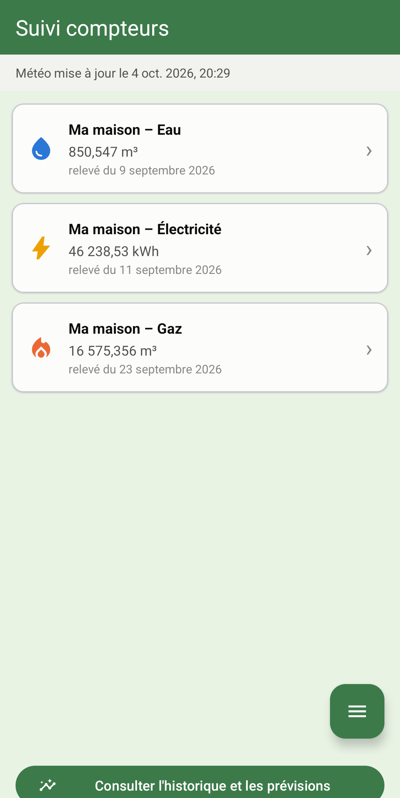
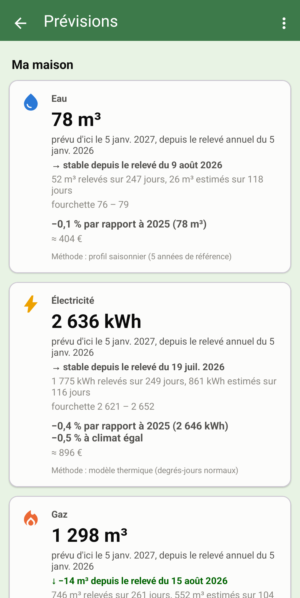
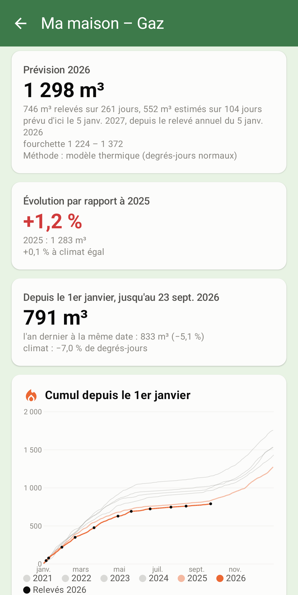
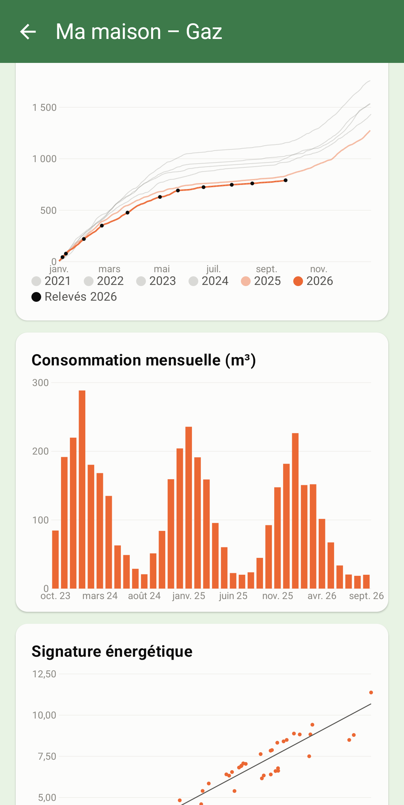
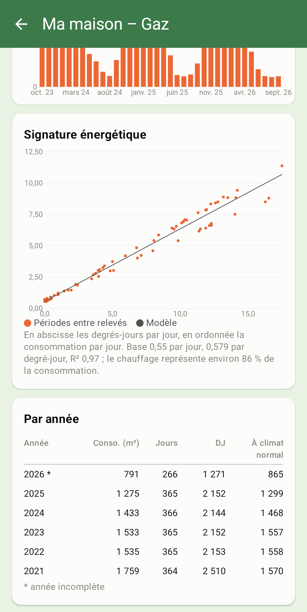
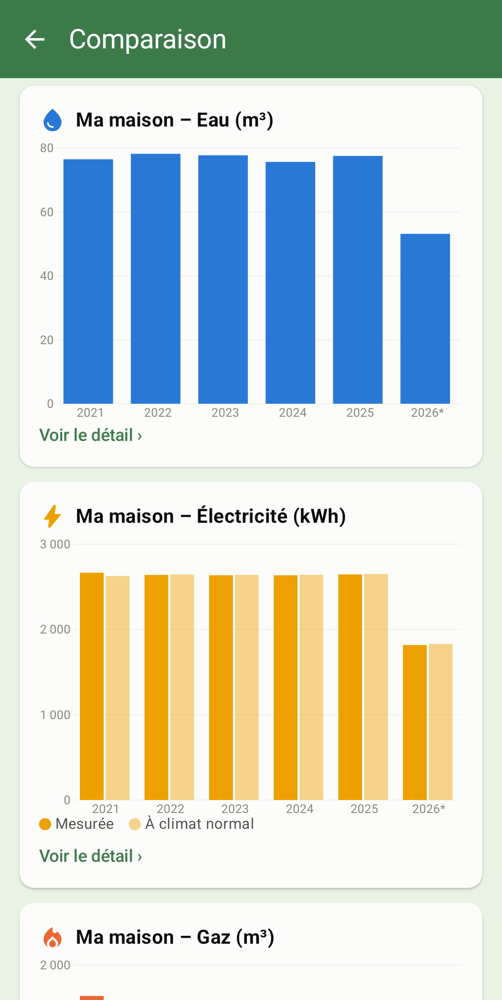
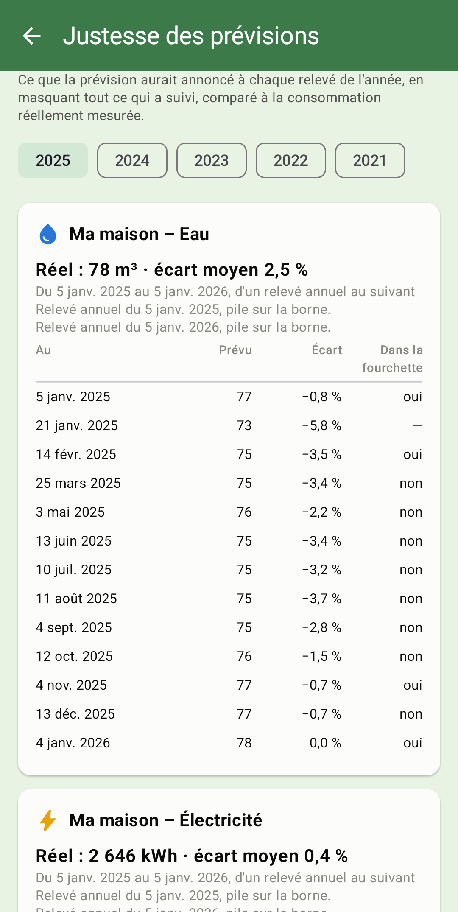
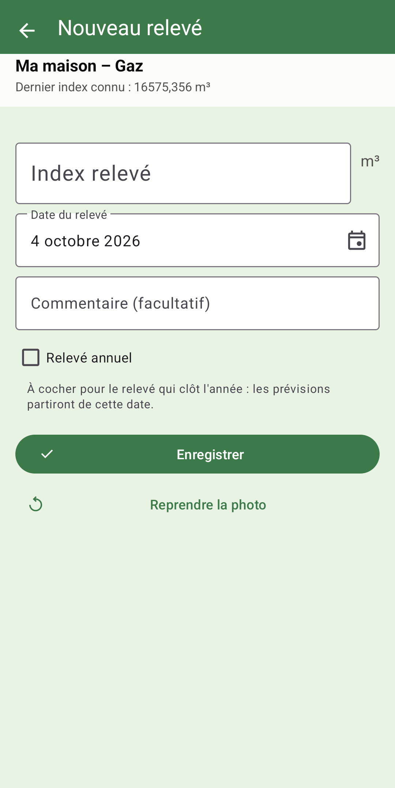

# Suivi compteurs

Application Android de suivi des compteurs d'eau, de gaz, d'électricité et de
mazout. Elle produit des graphiques, une prévision de l'année et une
comparaison inter-années **corrigée des degrés-jours**, afin qu'un hiver
rigoureux ne soit pas confondu avec une dérive de consommation.

Gratuite, sans compte ni publicité : toutes les données restent sur le
téléphone. Seule la météo vient d'Internet, d'[Open-Meteo](https://open-meteo.com/).

**[Page du projet](https://dooliesoft.github.io/suivi_compteurs_project/)**
· **[⬇ Dernière version](https://github.com/doolieSoft/suivi_compteurs_project/releases/latest)**
· **[♥ Faire un don](https://dooliesoft.github.io/suivi_compteurs_project/#soutenir)**

<table>
  <tr>
    <td width="25%"></td>
    <td width="25%"></td>
    <td width="25%"></td>
    <td width="25%"></td>
  </tr>
  <tr>
    <td align="center"><sub>Accueil : un appui sur un compteur pour le relever</sub></td>
    <td align="center"><sub>Prévisions de l'année, avec la tendance depuis un mois</sub></td>
    <td align="center"><sub>Détail d'une énergie : prévision, évolution, cumul</sub></td>
    <td align="center"><sub>Consommation mensuelle, année par année</sub></td>
  </tr>
  <tr>
    <td width="25%"></td>
    <td width="25%"></td>
    <td width="25%"></td>
    <td width="25%"></td>
  </tr>
  <tr>
    <td align="center"><sub>Signature énergétique : consommation selon le froid</sub></td>
    <td align="center"><sub>Comparaison des années, mesurée et à climat normal</sub></td>
    <td align="center"><sub>Justesse des prévisions passées</sub></td>
    <td align="center"><sub>Saisie d'un relevé</sub></td>
  </tr>
</table>

## Télécharger

| Où | Quoi |
|---|---|
| Google Play | mises à jour automatiques |
| [`suivi-compteurs.apk`](https://github.com/doolieSoft/suivi_compteurs_project/releases/latest/download/suivi-compteurs.apk) | avec lecture automatique de l'index sur photo (ML Kit) |
| [`suivi-compteurs-libre.apk`](https://github.com/doolieSoft/suivi_compteurs_project/releases/latest/download/suivi-compteurs-libre.apk) | sans composant propriétaire : l'index se saisit à la main (aussi destinée à F-Droid) |

Pour installer un APK : l'ouvrir depuis le gestionnaire de fichiers du
téléphone, et autoriser l'installation quand Android le demande. Les trois
versions sont signées différemment : passer de l'une à l'autre impose de
désinstaller, donc d'exporter ses données en Excel avant.

## Ce que fait l'application

- relevé d'un compteur, avec lecture automatique de l'index sur la photo,
  toujours soumise à confirmation ;
- contrôle de cohérence : un index ne recule pas, une date ne porte qu'un relevé ;
- prévisions de l'année, d'un relevé annuel au suivant ou en année civile ;
- détail de chaque énergie : cumul, consommation mensuelle, signature
  énergétique, index, années comparées à climat normal, coûts ;
- comparaison des années, climat, justesse des prévisions passées ;
- plusieurs maisons, remplacement de compteurs, tarifs, événements (travaux…) ;
- import et export Excel, qui tient lieu de sauvegarde (Google Drive compris) ;
- rappels de relevé ;
- français, anglais, néerlandais ; devise au choix.

## Comment les chiffres sont calculés

Le moteur de calcul est dans
[`android/app/src/main/java/be/suivicompteurs/app/moteur/`](android/app/src/main/java/be/suivicompteurs/app/moteur/),
en Kotlin pur, sans dépendance à Android.

### Des index aux consommations

Un relevé enregistre un **index**, pas une consommation. Entre deux index
peuvent s'écouler sept jours comme trois cents. Pour comparer des années, chaque
écart d'index est donc réparti sur les jours qu'il couvre : c'est la
*ventilation* (`Consommation.kt`).

Répartir uniformément suffit pour l'eau. Pour le gaz, c'est faux : 300 m³
consommés entre octobre et mars ne se répartissent pas à parts égales, ils
suivent le froid.

### Le modèle thermique

L'application ajuste donc, compteur par compteur, une droite :

```
consommation du jour = base + k × degrés-jours du jour
```

- **`base`** couvre ce qui ne dépend pas de la météo : eau chaude sanitaire,
  cuisson, veilles.
- **`k`** est la sensibilité au froid, en m³ (ou kWh) par degré-jour. C'est,
  en substance, le coût thermique du bâtiment.

L'ajustement se fait par moindres carrés pondérés par la durée des périodes :
une période de 300 jours pèse davantage qu'une de 7. Il n'est retenu que si
R² ≥ 0,5 ; sinon l'application retombe sur une répartition uniforme et le dit.

Le modèle n'est ajusté **que sur le gaz, le mazout et l'électricité**. La
consommation d'eau suit l'occupation du logement, pas la météo : une
corrélation apparente sur quelques années y serait fortuite, et la « corriger »
fausserait tout.

### La correction climatique

Une fois `k` connu, chaque année est ramenée à un hiver moyen :

```
consommation corrigée = consommation mesurée + k × (DJ normal − DJ réel)
```

Une année plus froide que la normale voit donc sa consommation revue à la
baisse, et inversement. C'est cette valeur corrigée qu'il faut comparer d'une
année à l'autre. Le **DJ normal** est la moyenne des dix dernières années pour
chaque jour calendaire.

### Les prévisions

Le réalisé n'est jamais réécrit : seuls les jours postérieurs au dernier relevé
sont estimés (`Previsions.kt`).

- **Modèle thermique** (quand il est fiable) : les jours restants sont estimés
  avec les degrés-jours *normaux* de la saison. Un automne doux n'est donc pas
  prolongé dans le mois de janvier suivant.
- **Profil saisonnier** (sinon) : on mesure, sur les années complètes passées,
  quelle fraction de l'année est déjà écoulée en consommation, et on divise le
  réalisé par cette fraction.

Avec un **relevé annuel**, l'année court d'un anniversaire de ce relevé au
suivant ; l'écart entre la date réelle du relevé et cette borne est estimé, pour
que les années restent comparables même si le relevé glisse de quelques jours.

La fourchette affichée reflète l'écart entre années de référence, non
l'incertitude météorologique à venir.

### Les degrés-jours

Un degré-jour vaut `max(0, base − température moyenne du jour)`. La base est de
**16,5 °C**, convention belge (DJ 16.5/16.5).

Les températures viennent d'[Open-Meteo](https://open-meteo.com/) (CC BY 4.0),
gratuit et sans clé : l'historique (réanalyse ERA5) complété par la prévision
pour les jours récents, que l'archive publie avec quelques jours de retard. La
mise à jour se fait d'elle-même une fois par jour.

## Développement

Construction, publication, organisation du code et tests :
[android/README.md](android/README.md). Publication sur le Play Store :
[fastlane/PUBLIER.md](fastlane/PUBLIER.md) ; sur F-Droid :
[fdroid/LISEZMOI.md](fdroid/LISEZMOI.md).

Le projet a commencé comme un site Django ; son moteur a été porté en Kotlin et
le site retiré du dépôt. Il reste dans l'historique Git, jusqu'à l'étiquette
`v1.2.2`.

## Licence

© doolieSoft. Distribué sous licence GNU GPL version 3 ou ultérieure : voir
[LICENSE](LICENSE). Vous pouvez utiliser, modifier et redistribuer
ce logiciel, y compris le vendre, à condition de publier sous la même licence
le code de toute version modifiée que vous distribuez.

Icônes : [Material Symbols](https://fonts.google.com/icons) de Google, sous
licence Apache 2.0.
